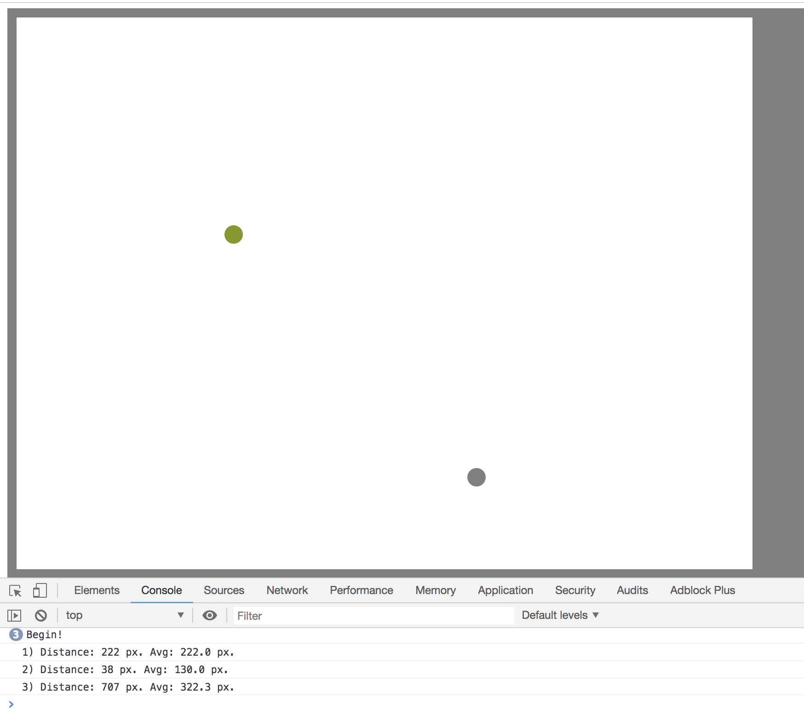

# Eye Test
> A simple website to test the peripheral color sensitivity of your eyes

The idea is that your eye's ability to detect colors outside the centre area is poor. We worse at red or green then blue. I came across an online test which showed this. I couldn't find it again years later, so I made my own one.

## Example



## Installation

There are no system requirements. You just need to be able to run a web server and a browser.

## Usage

1. Navigate to the repo's top-level directory.
2. Start a web server with your preferred approach.
    - Using Python:
        ```
        python3 -m http.server
        python2 -m SimpleHTTPServer
        ```
    - Static server one-liners list - [gist](https://gist.github.com/willurd/5720255)
3. Open the browser and follow the on-screen instructions. Open the browser console if you want to see the stats which are logged.
